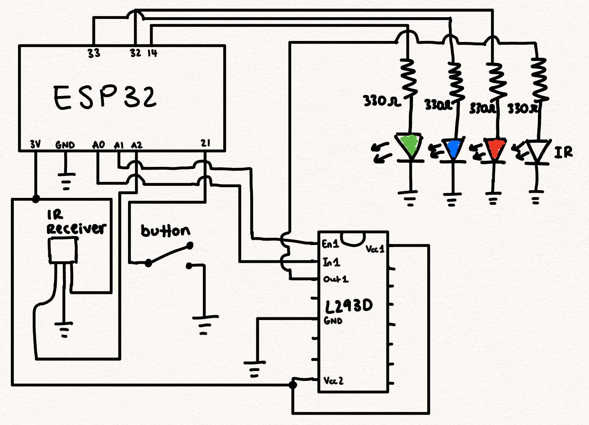

# 1. Secure E-Voting

## 2. Authors
Group 6: Josh Bardwick, Noah Hathout, Cole Knutsen, Trieu Tran

## 3. Date
11 - 07 - 2024

## 4. Summary
The project involves designing and building a secure voting system using fob devices that communicate via Near Field Communication (NFC) simulated via IR communication. The system features a distributed network where devices can dynamically connect, disconnect, reconnect, and elect a coordinator to manage voting processes. The coordinator also handles voter authentication and ensures secure sending of votes to a central server (the raspberry pi) with a database. The main focus was to execute secure data flow from individual voters' devices to a server, a voters election, and real-time results via a web UI. 

### Desired Behaviors

1. **Voter Authentication and Vote Casting**
   - Use NFC (simulated with IR) to authenticate voters and send their unique IDs as well as their vote to the system

2. **Coordinator Election and Failover**
   - Have a distributed system where devices can dynamically elect a coordinator using leader election algorithms. 
   - Ensure new election process and that a new coordinator is properly elected when previous coordinator fails, all without disrupting the voting process. 

3. **Secure Vote Transmission**
   - The device receiving NFC/IR communication passes the voter ID and the vote to the coordinator, which then sends the same data to the database server.
   - The coordinator sends a confirmation message back to the original fob that casted the vote.

4. **Data Logging and Web Interface**
   - Central database (using TingoDB) to log each vote with the respective voter ID. 
   - Web interface allowing access to the polling results.
   - The web server can reset the database on button click.

5. **Device Status Indication**
   - Use LEDs to display the state of each device (red for non-leader; blue for leader; and green is for timeouts).

### Solution Requirements

1. **Hardware Integration**
   - Use ESP32 devices equipped with IR transmitters and receivers to simulate NFC communication
   - Implement buttons on fobs to initiate the voting process.

2. **Network Communication**
   - Connect devices via WiFi to form one distributed-yet-connected system.
   - Implement UDP messages for the communication between devices connected to the server. 

3. **Coordinator Election**
   - Implement leader election algorithms and processes to select a coordinator among all connected devices. 
   - Ensure the system can handle coordinator failovers. 

4. **Database and Web Server**
   - Use Node.js and a database (TingoDB) on a Raspberry Pi hosted server. 
   - Log votes and provide real-time polling results on a web UI. 

5. **Concurrency and Synchonization**
   - Use FreeRTOS tasks for handling IR communication, button presses, network communication, and coordinator election tasks. 
   - Implement mutexes to protect shared data among tasks.

## 5. Solution Design
Note: ```ir-txrx.c``` is flashed to the ESP32 devices and handles the device operations including the NFC simulation via the IR transmitters, leader election, vote casting, and network communication. ```store_votes.js``` runs the Raspberry Pi server which handles incoming votes and stores them in the database located at ```mydb/votes```. The website is run using ```index.html``` as the frontend and can be accessed at ```http://192.168.1.103:8080```. 

1. **app_main:**
   - Initialize Mutexes and Semaphores.
   - Initialize UART and MCPWM for IR communication.
   - Set up GPIOs for buttons and LEDs.
   - Connect to WiFi.
   - Initialize timers for leader election and keep-alive. 

2. **Create FreeRTOS Tasks**
   - **button_task** (Button Task)
   - **ir_rx_task** (IR Receive Task)
   - **bully_algorithm_task** (Leader Election Task)
   - **recv_task** (UDP Receive Task)
   - **id_task** (LED ID Blink Task)
   - **continuous_ir_transmit_task** (IR Transmit Task)

3. **Button Task (```button_task```)**
   - **Loop**: 
     - Detect button presses via GPIO interrupt.
     - Count number of button presses to determine the voted ID.
     - Initiate vote transmittion when timer expires.

4. **IR Receive Task (```ir_rx_task```)**
   - **Loop**: 
     - Listen for incoming IR messages.
     - On receiving ```MSG_COORDINATOR_SIGNAL```, set ```is_member = true```.
     - Start leader election if not already a member.

5. **Leader Election Task (```bully_algorithm_task```)**
   - **Loop**: 
     - Check device state and participate in leader election using the Bully Algorithm.
     - Send and receive ```MSG_ELECTION```, ```MSG_ALIVE```, ```MSG_VICTORY```, and ```MSG_KEEP_ALIVE``` messages.
     - Update device state (```leader```, ```not_leader```, ```election```) and LEDs accordingly.

6. **UDP Receive Task (```recv_task```)**
   - **Loop**: 
     - Listen for incoming UDP messages on the device's port.
     - Process messages based on type:
        - **MSG_ELECTION**: Respond with ```MSG_ALIVE``` if higher ID. 
        - **MSG_VICTORY**: Update leader ID.
        - **MSG_KEEP_ALIVE**: Reset keep-alive timer.
        - **MSG_VOTE**: If coordinator, increment vote count and send confirmation of received vote.

7. **ID Task (```id_task```)**
   - **Loop**:
     - Blink the onboard LED to display the device's ID (2 blinks if ID == 2).

8. **IR Transmitting Task (```continuous_ir_transmit_task```)**
   - **Loop**:
     - If the device is the coordinator, it will continuously send ```MSG_COORDINATOR_SIGNAL``` via IR.
     - Delays between transmissions.

9. **Vote Casting**
   - When a vote is made by a button press:
     - **Non-Coordinator Device**:
        - Send ```MSG_VOTE``` to coordinator via UDP.
     - **Coordinator Device**:
       - Receive ```MSG_VOTE```, process the vote, and update the total votes per device. 
       - Send acknowledgement (```MSG_ACK```) back to the original voting device.
       - Forward vote data to the server via UDP on port ```4000```.

10. **Server (```store_votes.js```)**
    - **Setup**:
      - Initialize TingoDB database at ```mydb/votes```.
      - Create UDP server to receive votes on port ```4000```.
      - Serve web UI interface at ```http://192.168.1.103:8080``` using Express.js.
    
    - **Functions**:
      - Receive Votes
Circuit diagram:


## 6. Summary

### Potential Improvements
- **Hardware Interrupts**:  Use hardware interrupts for IR message reception to enhance real-time performance and reduce CPU load compared to polling-based detection.
- **Network Optimization**: Improve the reliability of UDP message passing between fobs and the Coordinator to minimize delays in vote transmission and confirmation.
- **Data Integrity**: Implement enhanced error-checking protocols for IR and network transmissions to ensure data accuracy and mitigate the impact of interference.
- **Security Encryption**:  Include encryption for data transmitted via IR and UDP to safeguard against interception, given the sensitivity of voting data.

### Results
The distributed voting system allows each fob to connect to the network and participate in elections for a Coordinator. Using NFC through IR, authenticated fobs submit votes for "Red," "Blue," or "Green" to the system. The elected Coordinator receives, logs, and transmits these votes to a central server, providing each voter with feedback through an LED confirmation. The web server offers an interface to monitor the status of votes and the current Coordinator, with options to reset the database.

### Challenges
- **Distributed Coordination**: Ensuring seamless leader election and fallback in case of Coordinator failure was complex due to real-time message synchronization across multiple devices.
- **IR Communication Reliability**: Accurate transmission over IR, especially for NFC-based authentication, required fine-tuning of timing and signal thresholds to handle environmental noise.
- **Security and Data Integrity**: Ensuring secure and reliable transmission across fob-to-fob and fob-to-Coordinator communication while maintaining system performance presented significant design considerations.

## 7. Artifacts
Everything that we needed for this quest was covered by the skills and we did not need to use external resources except code from ChatGPT that was present in our skills as well.

Link to report video:
- [Link to video demo](https://drive.google.com/file/d/1l6wGfmdgtvITa7rTuvHjnD1I_g9CTXzG/view?usp=sharing). 

Link to design demo:
- [Link to video demo](https://drive.google.com/file/d/14ioolii2PttAG8Jn80Jt-KU8r46mR65U/view?usp=sharing).

 ## 9. AI Code Assertions

All code is labeled appropriately "AI Generated".
